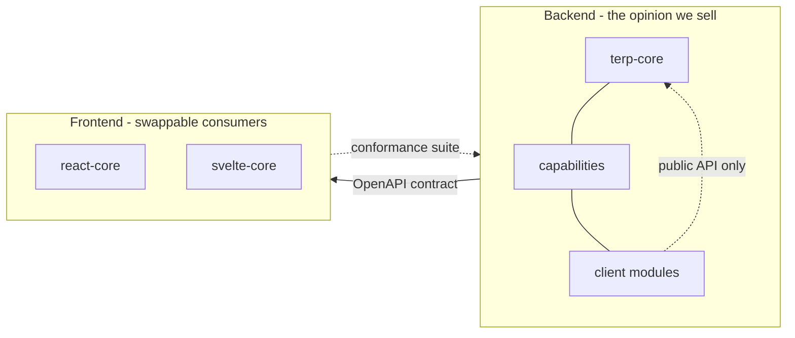
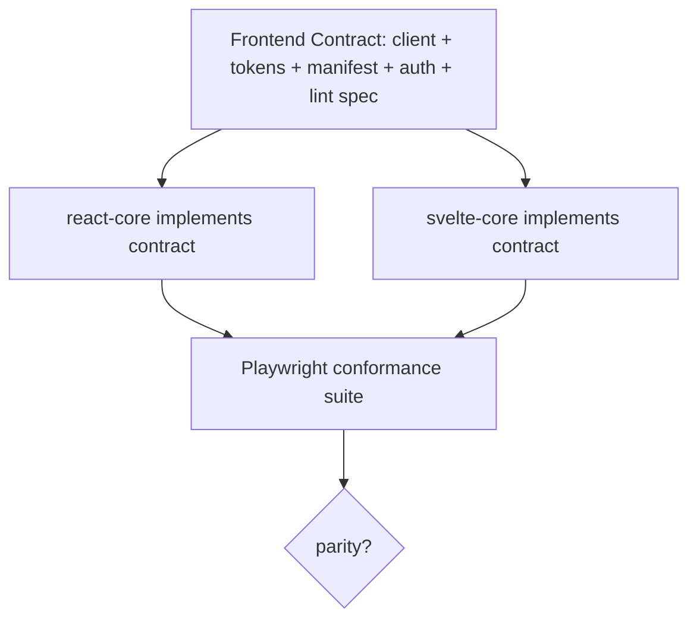

# Terp — Platform Design Document

> A maintained, versioned **core platform** that lets client teams (and their
> coding agents) build business **modules** quickly and safely, while the core
> stays **secure by default** and the **frontend stack is swappable**.
>
> **Status:** canonical design · **Audience:** platform/core team + module authors
> **Naming (authoritative):** Terp — "Trusted Enterprise Reinforced Platform"
> ("Build on high ground"). Python `terp.*`; distributions `terp-core` /
> `terp-arch` / `terp-cap-*`; npm `@terp/*`; CLI `terp`. `platform.*` is
> forbidden — it shadows a Python stdlib module. (This document originally used
> a placeholder namespace; `terp.*` is authoritative throughout.)

---

## 1. Purpose & scope

The thesis: a layered backend + architecture fitness tests + an escape‑hatch
budget keep an agent‑written codebase from drifting. This document specifies the
**product** that delivers it:

- A **core** we maintain and version, shipped as dependencies (not a fork).
- **Capabilities** (users, files, audit, …) the client turns on à la carte.
- **Modules** the client writes on top, as the *only* editable surface.
- An **enforcement harness** shipped *as a dependency* so clients cannot weaken it.
- A **frontend contract** so multiple frontend stacks (React, Svelte, …) can be
  maintained against one backend without drift.

The two explicit mandates for this revision are called out throughout with
callouts:

- 🔒 **Secure by default** — the safe path is the default; insecurity requires an
  explicit, visible, auditable opt‑out.
- 🔁 **Swappable frontend** — the frontend is a conformant consumer of a contract,
  not a hardwired part; several stacks can coexist and stay in parity.

### 1.1 Goals

1. A client developer (or agent) ships a new secure CRUD module in **< 1 hour**,
   writing only a model, schemas, a thin router, and a 6‑line manifest.
2. Forgetting a security step **fails closed** (denied / won't boot), not open.
3. The client **cannot** edit core or weaken the harness; they consume both.
4. Core internals can be refactored without breaking any client module.
5. The **same backend** serves products with **different tenancy models**.
6. **Two or more frontend stacks** can be offered and maintained in parity.
7. Agents have **full source visibility** of core without the ability to mutate it.

### 1.2 Non‑goals

- Swapping the **backend framework** (FastAPI/SQLModel). That is the opinion we
  sell; see §4.1. A different backend framework is a *separate product*.
- A runtime micro‑frontend / module‑federation system. Modules are build‑time.
- A no‑code builder. This targets professional developers using agents.

### 1.3 Defaults for a new platform repository

When scaffolding a new platform repository with this document as the main
handoff artifact, the coding agent must treat the choices below as **decided**
unless a human overrides them in the prompt:

1. **Python import namespace:** use `terp.*`, never `platform.*`.
  `platform` is a Python stdlib module; shadowing it will break imports and
  tooling. Distributions are `terp-core`, `terp-arch`, `terp-cap-*` (capabilities
  import as `terp.capabilities.<name>`); npm `@terp/*`; CLI `terp`.
2. **First frontend stack:** React first. Svelte is the second stack and is built
  only after the shared frontend contract and React conformance suite are green.
3. **Default tenancy:** organisation‑scoped by default. `single` is allowed only
  for demos/tests; visibility-based products use a pluggable row-visibility
  strategy rather than changing core.
4. **First implementation shape:** keep a single platform monorepo. Create
  package folders per §12.1; a repository split is an exception, not a goal, and
  only applies under the §12.3 conditions.
5. **Execution mode:** no big‑bang rewrite. Build incrementally, leaving each
  increment with a green gate and a short migration note.

### 1.4 Design choices

| Concern | Naïve approach | This design |
|---|---|---|
| Harness location | Local test files (editable) | **Dependency** (`terp-arch`); client can't weaken it |
| Harness size | Large bespoke AST test suite | Generic checks delegated to **Tach/import‑linter/deptry**; only domain rules bespoke |
| Security model | Tests *remind* you to add a guard | 🔒 **Deny‑by‑default runtime** + test detects omission (two layers) |
| Tenant isolation | Per‑query opt‑in mixin | 🔒 **Isolation by construction** (session‑level filter); opt‑out is explicit |
| Tenancy model | One scoping model baked into core | **Pluggable tenancy capability** (single / company‑visibility / scoped) |
| Frontend | One stack hardwired | 🔁 **Frontend contract** + conformance suite; multiple stacks |
| Module discovery | Filesystem only | Filesystem **+ entry points** (installable capabilities) |
| Public API | Implicit; modules can import anything | **Explicit public surface**; `_internal` is import‑forbidden |
| Agent visibility | N/A (monorepo) | **Vendored/editable core + generated API docs + instruction pack** |
| Company coupling | Hard‑coded integrations + localised UI | Genericised / parameterised / pluggable |

---

## 2. Design principles

1. **Secure by default, opt‑out by exception.** Every security control has a safe
   default and a *visible, greppable, budgeted* opt‑out.
2. **Two‑layer enforcement where runtime can enforce.** An invariant the running
   system can observe is a **fail‑closed runtime control** *and* a **build‑time
   fitness test** that catches its omission — the test is never the only control
   for such a rule. An invariant that exists only in the authored artifact
   (source form, imports, markers, checked‑in files) is build‑time‑only **by
   recorded decision, never silently**: every catalogued rule carries a
   machine‑checked `runtime.applicability` classification (`required` /
   `not-applicable` / `deferred`, ADR 0084) and an exemption always states why.
3. **The contract is the product.** Backend↔frontend couple only through the
   OpenAPI contract; modules↔core couple only through a published **public API**.
4. **Enforcement travels as a dependency.** Rules ship versioned; clients run them
   and cannot edit them.
5. **Convention over configuration.** Discovery + base classes mean "create files
   in the right place" — no central registration.
6. **Agent‑first ergonomics.** Source is visible, the contract is documented in‑repo,
   scaffolding is one command, and rules produce precise, fixable messages.
7. **Generalise on evidence.** Anything in core must be validated by **two
   structurally divergent consumers** (e.g. an organisation‑scoped app and a
   visibility‑based app).

---

## 3. System overview

### 3.1 Package topology

```
BACKEND (Python)                      FRONTEND (per stack, e.g. @terp/react, @terp/svelte)
  terp-core             (pip)           @terp/contract           (npm) — generated client + tokens + manifest types
  terp-cap-identity     (pip)           @terp/react-core         (npm) — shell, guards, UI primitives (React)
  terp-cap-auth         (pip)           @terp/svelte-core        (npm) — shell, guards, UI primitives (Svelte)
  terp-cap-access       (pip)           @terp/eslint-boundaries  (npm) — boundary rules (shared spec)
  terp-cap-tenancy      (pip)           @terp/conformance        (npm) — Playwright parity suite (stack-agnostic)
  terp-cap-users        (pip)
  terp-cap-groups       (pip)         TOOLING
  terp-cap-oidc         (pip)           terp-cli                 (pip) — new module, migrate, check, api-docs
  terp-cap-files        (pip)           terp-template            (copier) — repo skeleton, CI, AGENTS.md
  terp-cap-audit        (pip)
  terp-cap-eventbus     (pip)
  terp-cap-webhooks     (pip)
  terp-cap-outbox       (pip)
  terp-cap-sync         (pip)
  terp-cap-redis        (pip) — shared Idempotency/Throttle/Cache stores (ADR 0078)
  terp-cap-jobs-celery  (pip)
  terp-cap-scheduler-apscheduler (pip)
  terp-cap-scheduler-celery-beat (pip)
  terp-migrations       (pip) — packaged migration engine (ADR 0027)
  terp-arch             (pip, dev) — the fitness harness (parameterised over app/)
```

The client repo depends on a chosen profile of these and contains **only modules**:

```
their-app/
  pyproject.toml            # terp-core==2.*, terp-cap-{auth,users,files}, terp-arch (dev)
  app/
    main.py                 # create_app()  ← discovery wires everything
    modules/                # THE ONLY EDITABLE BACKEND SURFACE
      billing/ {module.py, models.py, schemas.py, service.py, router.py, migrations/}
  vendor/terp-core/         # read-only mirror for agent visibility (see §10)
  docs/platform-api.md      # generated public-API reference (regenerated on upgrade)
  frontend/                 # chosen stack; src/modules/* is the only editable UI surface
  alembic/  tests/  .github/  .vscode/
```

### 3.2 The three coupling seams



- **Backend framework**: fixed (§4.1).
- **Modules ↔ core**: published **public API**; `_internal` forbidden (§4.4).
- **Backend ↔ frontend**: the **OpenAPI contract** + the frontend contract (§7) —
  this is the seam that makes the frontend swappable.

---

## 4. Backend architecture

### 4.1 Why the backend framework is fixed

`terp-core` *is* the FastAPI + SQLModel/SQLAlchemy + Pydantic opinion: base
classes, DI, OCC (`version_id_col`), auth dependencies, and the fitness tests all
assume these primitives. Abstracting them away would destroy the typed/enforced
value. Swapping the backend framework = building a parallel product that shares
*methodology*, not code. This is a deliberate non‑goal.

### 4.2 Layers

| Layer | Root | Contents | May import |
|---|---|---|---|
| 0 Kernel | `terp-core` | base classes, config, security, db, errors, discovery, `ModuleSpec` | nothing above |
| 1 Capabilities | `terp-cap-*` | cross‑cutting: eventbus, audit, identity, access, auth, users, groups, oidc, files, webhooks, outbox, sync, redis, jobs/schedulers, **tenancy** | core + strictly‑lower caps |
| 2 Foundation | `app/foundation/*` (optional) | shared domain anchors: users, projects, files, organizations | core, capabilities |
| 3 Modules | `app/modules/*` | leaf business domains (client‑owned) | core, capabilities, foundation — **never each other** |

Composition roots (`bootstrap`, `api`, `workers`) may import anything. Layering is
enforced by **Tach** config (not bespoke AST), with the keystone "core imports
nothing above" retained as a tripwire test.

### 4.3 The extension API: `ModuleSpec`

A module exposes exactly one manifest. This is the entire public extension surface.

```python
# app/modules/billing/module.py
from terp.core import ModuleSpec, Policy, Roles

module = ModuleSpec(
    name="billing",
    router=router,                      # auto-mounted at /api/v1/billing
    services=[InvoiceService],          # registered for DI
    requires=["users", "files"],        # capability deps; checked at boot
    events=["invoice.paid"],            # declared on the event bus
    # 🔒 Security posture is DECLARED, with safe defaults (see §5):
    policy=Policy.default(),            # authenticated; mutations require EDITOR
    tenant_scoped=True,                 # rows are isolated per tenant by construction
)
```

Discovery (filesystem for in‑repo modules, **entry points** for installable
capabilities) collects every `ModuleSpec` and wires routers, DI, models (for
migrations), events, and nav — with no central edits.

### 4.4 Public API surface (new)

`terp-core` exposes a curated `terp.core` namespace
(base classes, deps, `ModuleSpec`, `Policy`, helpers). Everything else lives
under `terp.core._internal`.

- Fitness test: **modules may import only the public surface + declared
  capabilities** — never `_internal`, never a sibling module.
- Consequence: core internals refactor freely across minor versions; the public
  surface is the semver contract.

### 4.5 Base classes (kept, hardened)

- `BaseTable` — `id` (UUID), `created_at`, `updated_at`, `version` (OCC). Opt‑in
  `SoftDeleteMixin`, `TenantScopedMixin` (see §5.3).
- `BaseSchema` / `BaseUpdateSchema` (required `version` for OCC).
- `BaseService[Model, Create, Update]` — CRUD, pagination, eager‑loading hooks.
  Subclasses declare `model = …`.

### 4.6 Migrations across packaged core + modules

Each table-owning package (capability or app module) ships its **own**, *linear*
Alembic history *inside its package*, isolated by its own `alembic_version_<label>`
table. A Terp-owned `env.py` (consumers never hand-write one) discovers them and
`terp migrate upgrade` runs each package's `upgrade head`; there is no shared
multi-branch graph, so there are no merge migrations or multiple heads (independent
histories supersede the earlier "branch labels" sketch — see
[ADR 0027](docs/decisions/0027-packaged-migrations-per-package-histories.md)).
Capabilities are FK-less leaves, so package order is never a correctness constraint.
A fail-closed boot guard refuses to start against a schema behind the code. This is
the highest-risk subsystem and was designed first, with a dedicated conformance test
(install capability → upgrade → downgrade) plus a drift test (migrations == models).

**Deliberate database posture (recorded so evolution stays additive, ADR 0072):**
model metadata is schema-free and enum-free with a deterministic constraint naming
convention from day 1, so physical layout, dialect and constraint changes never
require touching models; persistence is synchronous `Session` by design (an async
variant would land as a *parallel* session seam, never a rewrite); one primary
engine (a read-replica seam is an additive `create_app` parameter when a consumer
needs it); UUIDv4 keys (a v7 switch is a generator default, not a schema change);
DBA-gated shops render offline SQL with `terp migrate upgrade --sql`.

---

## 5. 🔒 Secure‑by‑default model (primary mandate)

**Principle:** a developer who does nothing special gets a secure result. Every
insecure action requires an explicit, greppable, budgeted opt‑out. A control
whose invariant the running system can observe is **two‑layered** — a
fail‑closed runtime control *plus* a build‑time test — and which rules those
are is recorded per rule in the Terp Standard catalog
(`runtime.applicability`, ADR 0084); a source‑form invariant is
build‑time‑enforced by recorded decision, never silently.

### 5.1 Deny‑by‑default authorization

The framework — not the developer — mounts every module router behind a guard
derived from its `ModuleSpec.policy`. **A router with no declared policy is denied.**

```python
# terp.core.app.create_app (simplified)
for spec in discovered_modules:
    if spec.policy is None:
        raise BootError(f"module '{spec.name}' declares no Policy")   # fail to boot
    guard = build_guard(spec.policy)            # default: authenticated principal
    app.include_router(spec.router, dependencies=[Depends(guard)])
```

- Default `Policy.default()` = **authenticated**, and **mutations
  (POST/PUT/PATCH/DELETE) require a write role** (EDITOR+). Read = VIEWER+.
- Truly public endpoints must opt in: `Policy.public(reason=...)` → recorded on an
  allowlist with a justification, counted by the escape‑hatch budget.
- Runtime control: missing/looser policy ⇒ request denied / app won't boot.
- Build‑time test: `test_mutations_require_write_role`, `test_public_routes_justified`.

> 🔒 Contrast a setup where you must *remember* `RequireModuleRole`. Here the
> default is closed and forgetting denies access rather than exposing it.

### 5.2 No raw data leaves the boundary

- Every route declares a `response_model` (or returns an explicit DTO). The
  framework refuses to serialise a bare ORM instance; a fitness test catches the
  omission. Prevents accidental column/secret leakage.
- Secret‑typed fields are **masked by default** in any serializer.

### 5.3 Tenant isolation by construction

Tenant isolation has two separate concerns and the framework must not collapse
them into one check:

- **Membership isolation** — which rows belong to the caller's tenant/org/site.
- **Resource permission** — whether the caller may read or mutate that specific
  row (for example owner/company‑wide/admin semantics).

Membership isolation must **not** depend on the developer remembering a `WHERE`
clause. A session‑level event injects the membership predicate on every query
against a `TenantScoped` entity (the same mechanism used for
soft‑delete):

```python
@event.listens_for(Session, "do_orm_execute")
def _tenant_filter(state):
    if state.is_select and not state.execution_options.get("include_all_tenants"):
        # AND tenant_id = current_tenant_id()  for every TenantScoped target
        ...
```

- A naive query still returns only the caller's tenant rows.
- Cross‑tenant access requires `.execution_options(include_all_tenants=True)` —
  explicit, greppable, and flagged by a fitness test unless allowlisted.
- The *meaning* of "tenant" is supplied by the **tenancy capability** (§6), so the
  same machinery serves single‑tenant, company‑visibility, and scoped models.
- Resource permissions are enforced by `AccessStrategy` methods with distinct
  semantics: `can_read(entity, principal)` and `can_mutate(entity, principal)`.
  For visibility‑based products, read may be wider than write; **never reuse the
  read predicate as the mutation predicate**.

### 5.4 Secrets sealed by default

- A first‑class secrets helper: `encrypt_config` / `mask_config` / `decrypt_config`.
- `decrypt_config` may be called from **exactly one allowlisted endpoint**; every
  other surface returns masked values. Enforced by `test_decrypt_single_call_site`.

### 5.5 Authentication hardening (defaults)

- Password hashing: Argon2id (bcrypt fallback), per‑user salt.
- Brute‑force lockout + rate‑limit on auth endpoints, on by default.
- JWT: short‑lived access + rotating refresh; cookie auth ships with CSRF tokens.
- Pluggable SSO providers (OIDC/SAML) — no vendor tenant baked in.

### 5.6 Safe transport & input defaults

- Security headers (HSTS, X‑Frame‑Options, X‑Content‑Type‑Options, referrer
  policy) via default middleware.
- **CORS deny‑by‑default**; an explicit allowlist is required to boot in prod.
- Every `*Create`/`*Update` `str` field must declare `max_length`
  (fitness test) — caps payloads.
- **Pagination mandatory** on list endpoints; no unbounded queries.
- ORM‑only data access; raw/interpolated SQL is forbidden (fitness test). No
  `eval`/`pickle`/`mutable default args`/naive `datetime`.

### 5.7 Production fail‑fast guardrails

In `APP_ENV=production` the app **refuses to boot** with: short/missing
`SECRET_KEY`, permissive CORS, debug on, SQLite, missing TLS, default
credentials, or an in‑memory event bus. Enforced by `test_production_guardrails`.

### 5.8 Audit by default

Mutating routes auto‑emit an audit event (who/what/when/before/after) via the
audit capability — traceability without developer wiring. Opt‑out is allowlisted.

### 5.9 Supply‑chain & secrets hygiene

Pinned dependencies + lockfiles, Dependabot, secret scanning, SBOM generation,
and signed releases. The harness fails the build on a known‑vulnerable dependency.

### 5.10 The secure‑default rule catalog

A row whose invariant is runtime‑observable pairs a runtime control **and** a
test — those rules carry `runtime.applicability: required` in the Terp Standard
catalog (ADR 0084), and there the runtime control is what actually protects
production while the test detects omission. For the rest, the runtime column
names the *ambient or constructive* mechanism (the ORM‑only data path, the
compliant helper) and the rule is build‑time‑enforced by recorded, per‑rule
decision — e.g. the module‑boundary, raw‑SQL and input‑cap rows below.

| Invariant | 🔒 Runtime default (the control) | 🧪 Build‑time test (the reminder) | Tooling |
|---|---|---|---|
| AuthZ present | Router denied unless `Policy` declared | `test_routes_declare_policy` | bespoke |
| Write needs write‑role | Mutations require EDITOR+ | `test_mutations_require_write_role` | bespoke |
| Tenant isolation | Session filter injects tenant predicate | `test_no_cross_tenant_optout_unjustified` | bespoke |
| No raw ORM out | Serializer refuses bare ORM | `test_routes_declare_response_model` | bespoke |
| Secrets masked | Masked by default; 1 decrypt site | `test_decrypt_single_call_site` | bespoke |
| Module boundaries | import of `_internal`/siblings fails at test | `Tach` layering + `test_public_api_only` | Tach |
| No raw SQL | ORM‑only | `test_no_raw_sql` | ruff + bespoke |
| Input caps | `max_length` required | `test_str_fields_have_max_length` | bespoke |
| Pagination | list endpoints require `PaginationParams` | `test_list_routes_paginated` | bespoke |
| Prod config | app won't boot if unsafe | `test_production_guardrails` | bespoke |
| Vuln deps | — | CI supply‑chain scan | deptry/pip‑audit |

---

## 6. Tenancy as a pluggable capability

Tenancy is **not** baked into core. Isolation lives in `terp-cap-tenancy`,
which supplies the tenant context, the membership predicate injected by §5.3,
and an `AccessStrategy` for per‑resource read/write semantics. Swappable
strategies:

| Strategy | "Tenant" = | Validated by |
|---|---|---|
| `organization` | `organization_id` / `tenant_id`; read and write inside tenant by role | default base profile |
| `single` | no tenant predicate; only for demos/tests/local tools | smallest apps |
| `visibility` | tenant partition + visibility marker + owner; read/write semantics are supplied by the strategy | visibility‑based profile |
| `scoped` | a scoping column (e.g. site/region), with role gates per scope | scoped profile |
| `org-hierarchy` | nested organisation tree | future |

The same `TenantScoped` membership filter serves all strategies, but the
strategy owns its resource permissions. Because both visibility-based and scoped
models are expressible, the core is proven tenancy‑agnostic by construction.

---

## 7. 🔁 Frontend contract & multi‑stack strategy (primary mandate)

The client wants to **maintain several frontend stacks** (e.g. React *and*
Svelte). We make that tractable by defining a **stack‑agnostic Frontend Contract**;
each stack is a *conformant implementation*, and a single shared suite proves
parity. The backend is unaware of which stack is mounted.

### 7.1 The Frontend Contract (what every stack must implement)

1. **API client** — generated from the backend OpenAPI. One source of truth; both
   stacks consume the same TypeScript types. The frontend cannot drift from the
   backend.
2. **Design tokens** — a framework‑agnostic token source (`tokens.json` via Style
   Dictionary → CSS variables). One theme, many renderers; guarantees visual
   parity.
3. **Module/route/nav manifest** — a declarative, stack‑agnostic description of a
   module's UI surface:

   ```jsonc
   // frontend module manifest (stack-agnostic)
   {
     "name": "billing",
     "routes": [{ "path": "/billing", "view": "BillingList", "role": "VIEWER" }],
     "nav":    [{ "label": "Billing", "to": "/billing", "icon": "receipt" }]
   }
   ```
   Each stack ships a thin **adapter** that realises the manifest into its router
   (TanStack Router for React, SvelteKit routes for Svelte) and sidebar.
4. **Auth/session contract** — a defined interface (`login`, `refresh`,
   `currentUser`, `can(module, action)`); each stack implements identical
   semantics (token/cookie handling, route guards). UI gating (`canEdit`,
   `canAdmin`) honours the backend roles identically.
5. **Boundary‑lint spec** — the module‑boundary rules (no cross‑module imports, no
   reaching into core internals, **design‑token‑only styling**, no raw
   `<button>`/`<input>`, routed pages not modals for forms) are declared **as data**
  in `@terp/eslint-boundaries`; each stack provides a parser adapter. The
   *rules* are shared; only the *enforcement adapter* is per‑stack.

### 7.2 The equaliser: a shared conformance suite

`@terp/conformance` is a **Playwright** suite (framework‑agnostic) that every
stack core must pass: same routes resolve, same guards deny/allow, same a11y
landmarks, same token‑driven visuals, same error envelope handling. This is how
multiple stacks stay in parity and remain maintainable — adding or upgrading a
stack means "make the conformance suite green," not "re‑derive correctness."



### 7.3 What it costs (be honest)

Maintaining N stacks is ~N× the *frontend* work. The contract + conformance suite
**bound and de‑drift** that cost; they do not erase the multiplication. Pragmatic
rollout:

- **Stack A (primary): React**. It is fully built first and defines the
  contract by construction.
- **Stack B (e.g. Svelte)**: a conformance‑driven port; ships when the suite is
  green.
- Each client project **pins one stack**; the platform *maintains* several.

### 7.4 Frontend security parity

The boundary‑lint spec also carries the **frontend** security defaults: tokens‑only
styling (no inline colours that bypass theme/contrast), no `dangerouslySetInnerHTML`
/ `{@html}` without an allowlist, generated client only (no hand‑rolled fetch that
could skip auth/CSRF), and routed pages for forms (predictable guards). These are
part of conformance, so every stack enforces them identically.

---

## 8. The enforcement harness (`terp-arch`)

- **Shipped as a versioned dependency**, parameterised over the consuming app's
  `app/` (and `frontend/`). Clients run it; they cannot edit the rules.
- **Delegates generic checks** to maintained tools — **Tach/import‑linter**
  (layering), **deptry/pip‑audit** (deps), **ruff** (security `S`, simplify) — and
  hand‑rolls only the domain‑specific rules from §5.10. This keeps the bespoke
  surface small.
- **Escape‑hatch budget** (ratchet): `# arch-allow-*` marker counts must match a
  checked‑in JSON and may only decrease. New exceptions require a justified budget
  bump in the same change; removed ones lock the win in.
- **"Docs can't lie"** parity test: every "Enforced by test_X" claim in `AGENTS.md`
  resolves to a real test.
- Runs in **< a few seconds** (AST/static; no app import) so it gates every push.

---

## 9. Agent‑experience design

The platform is optimised for agentic development:

- **Scaffolding**: `terp new module billing` generates the folder, a passing
  test, and the manifest. The "10‑minute module" path (model → schemas → service →
  thin router → `migrate make` → `check`).
- **In‑repo contract**: `terp api-docs` writes `docs/platform-api.md` (every
  public class/dep/event with signatures + examples), regenerated on upgrade. The
  agent reads the contract first, source only when debugging.
- **Instruction pack**: `AGENTS.md` + per‑area `.instructions.md` + a module
  cookbook of copy‑paste references travel in the client repo.
- **Precise failures**: every fitness test emits a *fixable* message ("module
  billing imports `terp.core._internal.db`; use
  `terp.core.SessionDep`").
- **`.vscode/settings.json`** keeps core source searchable (see §10).

---

## 10. Agent visibility without editability

"Packaged" must not mean "invisible." The core is a dependency for runtime and
upgrades, but its source and contract are present and indexed in the workspace —
the boundary is enforced by the harness, not by hiding code.

1. **Vendored read‑only core** under `vendor/terp-core/` (git submodule) — or
   `pip install -e` for core developers; **frontend cores as pnpm `workspace:*`
   packages with `src/`** (never minified `dist/`). The agent sees everything.
2. **Generated `docs/platform-api.md`** + `.pyi` stubs — the primary reference.
3. **`test_vendored_core_unmodified`** / CODEOWNERS — editing core fails CI.
4. **`.vscode/settings.json`** does not exclude `vendor/` or `terp*` from
   search; `AGENTS.md` points the agent at them.

Net: the agent has monorepo‑level visibility while the maintenance boundary holds.

---

## 11. Packaging, versioning & upgrades

- **Semver** on every package; the **public API surface** (§4.4) is the contract.
- Patch/minor never break modules; a breaking **major** fails the client's gate
  with a precise message. Internals move freely behind the public surface.
- **Capabilities are extras**: `pip install "terp-core[users,files]"`;
  "stages" are installed capabilities, **not** separate repos.
- **`copier update`** pulls non‑package scaffold changes (CI, config, instructions).
- Frontend cores are versioned per stack and gated by the conformance suite.

---

## 12. Repository & ownership topology

**Separate packages do not require separate repositories.** The package split in
§3.1 is about *release units*, not *repos*. The default is a **single platform
monorepo** with many independently versioned, independently published packages.

### 12.1 Default: one platform monorepo

| Path (one repo) | Contents | Who writes |
|---|---|---|
| `packages/backend/core` | `terp-core` | Platform team |
| `packages/backend/capabilities/*` | `terp-cap-*` | Platform team |
| `packages/backend/arch` | `terp-arch` (harness) | Platform team |
| `packages/backend/cli` | `terp-cli` | Platform team |
| `packages/frontend/contract` | `@terp/contract` (client + tokens + manifest types) | Platform team |
| `packages/frontend/react-core` | `@terp/react-core` | Platform team |
| `packages/frontend/svelte-core` | `@terp/svelte-core` (later) | Platform team |
| `packages/frontend/eslint-boundaries`, `packages/frontend/conformance` | shared lint spec + Playwright parity suite | Platform team |
| `template/` | copier skeleton, CI, AGENTS.md | Platform team |
| `apps/example/` | neutral dogfood app consuming packaged core | Platform team |

Why monorepo is the default here:

- **Atomic contract evolution.** A breaking API change + the regenerated client +
  every frontend core + the conformance suite change in **one PR, one CI run**.
  Across split repos this becomes a multi‑repo, multi‑PR sequence.
- **Conformance needs both sides.** The Playwright suite drives each frontend
  against a real backend; co‑location makes that trivial.
- **Small platform team + agentic dev.** One CI graph, less coordination, and the
  agent sees backend + frontend + contract in one workspace.
- Monorepo ≠ lockstep versioning. Use **per‑package semver** (e.g. changesets +
  tags); orchestrate the polyglot build with Turborepo/Nx + `uv` workspace + pnpm.

### 12.2 The contract is a published artifact regardless of repo layout

Whatever the repo topology, the **OpenAPI contract, the generated clients, and the
design tokens are published as versioned artifacts**. Downstream client apps and
each frontend stack consume those artifacts — never the monorepo directly. This is
why splitting backend/frontend into separate repos buys little isolation you do not
already get from versioned packages.

### 12.3 Exception: split into multiple repos only when…

Adopt a backend‑repo + frontend‑repo (or finer) split **only** when one of these
dominates — and accept the versioned‑contract + published backend test image cost:

- Independent teams own backend vs frontend with **different release cadences** or
  **access/compliance boundaries**.
- A frontend becomes a **genuinely separate product** (e.g. a native mobile app)
  consuming the same contract.

### 12.4 Client applications

Each **client app is its own monorepo** (`app/modules/*` + `frontend/src/modules/*`
+ a pinned single frontend stack), written by the client (and us on retainer). The
generated client regenerates locally so API + UI changes land in one PR.

CODEOWNERS protects core/capabilities/CI; the client app's core is vendored
read‑only (§10). Conventional Commits + automated release/changelog per package.

---

## 13. Build plan (phases)

Phased, each phase shippable. When this document is used as the only detailed
instruction, follow these gates strictly:

- **Classify before you cut.** Decide core / capability / example / drop /
  parameterise before moving any domain code.
- **Do not split repositories early.** Use the monorepo package layout below
  until the dogfood app runs against packaged core.
- **Do not proceed to the next phase with a broken gate.** Each phase must leave
  a runnable app or a deliberate, documented temporary compatibility shim.

Package layout:

```text
packages/backend/core/src/terp/core/
packages/backend/arch/src/terp/arch/
packages/backend/capabilities/<name>/src/terp/capabilities/<name>/
packages/frontend/contract/
packages/frontend/react-core/
packages/frontend/svelte-core/        # created later, after React conformance
apps/example/                         # the neutral app consuming packaged core
```

0. **Inventory & triage** — classify every candidate package as core / capability /
   example / drop / parameterise; produce the public‑API surface list.
   - *Capability*: identity, auth (pluggable SSO), access, audit, eventbus, users,
     files, **tenancy**.
   - *Example*: a genericised example module (business nouns such as `projects`
     are client modules, never capabilities — ADR 0060).
   - **Gate:** the baseline test/lint state is recorded before any code moves.
1. **Carve `terp-core`** (L0, product‑vocabulary‑free) + `ModuleSpec` + public
   surface + `.pyi`/api‑docs generator.
   - **Gate:** no company or product constants in `terp.core`; `terp.core`
     imports nothing above itself; `from terp.core import ModuleSpec` works.
2. **Repackage capabilities** as entry‑point extras; define the base profile
   (core + auth + access + identity + users; ADR 0060).
   - **Gate:** installing a capability via entry point mounts its router and exposes
     its models to Alembic without editing `main.py` or `env.py`.
3. **Ship `terp-arch`** as a dependency; delegate layering to Tach.
   - **Gate:** client modules can run the harness but cannot edit its rule source;
     the escape‑hatch budget and docs‑parity tests run from the package.
4. **Frontend contract + Stack A (React)**; extract eslint boundary spec
   + conformance suite.
   - **Gate:** React consumes `@terp/contract`; no stack‑specific API
     client or hand‑rolled fetch is allowed.
5. **Scaffolding**: copier template + `terp` CLI.
   - **Gate:** `terp new module billing` creates a backend and frontend module
     that passes the local gate without manual central registration.
6. **Agent‑visibility** layer (§10).
  - **Gate:** `vendor/terp-core/` is indexed, documented, and protected by a
     `test_vendored_core_unmodified` check.
7. **Migrations** across packaged core + modules (§4.6) — design first.
   - **Gate:** install capability → upgrade → downgrade works with multiple Alembic
     version locations and independent per-package histories.
8. **Dogfood**: build the example app **and** a second divergent consumer of the
   row-scope seam — a visibility-based strategy beside the tenant partition
   (ADR 0061: the example app's `journals` module registers an owner-keyed
   `shared`/`private` read predicate; `projects` stays the organisation-scoped
   consumer).
   - **Gate:** both the organisation-partition and visibility-based strategies pass
     cross‑tenant and same‑tenant private/write‑access tests.
9. **Stack B (Svelte)** as a conformance‑driven port; docs, semver, release v0.1.
   - **Gate:** Svelte passes the same frontend conformance suite as React.

### 13.1 Minimal handoff prompt

Use this short prompt when scaffolding a new platform repository:

> Build Terp, the platform described in `AGENTIC_PLATFORM_DESIGN.md`. Follow §1.3
> defaults and the §13 phase gates strictly. Start with the Phase 0 inventory and
> public API surface; record the baseline test/lint state before moving any code.
> Use the `terp.*` Python namespace.

---

## 14. Risks & mitigations

| Risk | Impact | Mitigation |
|---|---|---|
| Packaged‑migration complexity | High | Design §4.6 first; dedicated conformance test |
| Maintaining N frontend stacks | Med‑High | Contract + Playwright conformance bound the cost; pin one stack per client |
| Auth de‑coupling from a single SSO vendor | Med | Pluggable provider refactor; keep email+pw path green throughout |
| Users capability is a fresh build | Med | It persists nothing today; treat as new build, not a port |
| Harness false positives blocking clients | Med | Escape‑hatch budget + precise messages + a documented exception path |
| Core team becomes a bottleneck | Med | Capabilities are additive; clients own modules; retainer SLA on core |
| "Secure by default" complacency | Med | Two‑layer model where runtime can enforce (per‑rule `runtime.applicability`, ADR 0084): fail‑closed runtime controls carry the `required` rules; build‑time‑only rules are exempt by recorded, reviewable decision |

---

## 15. Defaults & deferred decisions

The items below are **not blockers** for the first build; use the defaults in
§1.3 unless the prompt overrides them.

1. **Frontend sequence:** React first, Svelte second.
2. **Default tenancy strategy:** `organization`.
3. **Agent‑visibility mode:** vendored read‑only core by default; editable install
  only for platform‑core development.
4. **Hosting:** offered as a paid managed add‑on or client‑run only.
5. **Where the example module lives:** in the template or a separate
   `platform-examples` package.

---

### Appendix A — "10‑minute module" (developer experience)

```bash
terp new module billing              # scaffold + passing test + manifest
# edit models.py (inherit BaseTable), schemas.py (BaseSchema), service.py (model=Invoice),
# router.py (thin; Policy.default() gives secure-by-default authz)
terp migrate make -m "billing"       # autogenerated migration
terp check                           # runs the full gate locally (== CI)
```

The developer wrote one model, a few schemas, a thin router, and a 6‑line
manifest. Auth, tenant isolation, OCC, audit, pagination, response discipline,
CI/CD, and migration wiring were inherited — and the gate proved the boundary was
respected.
