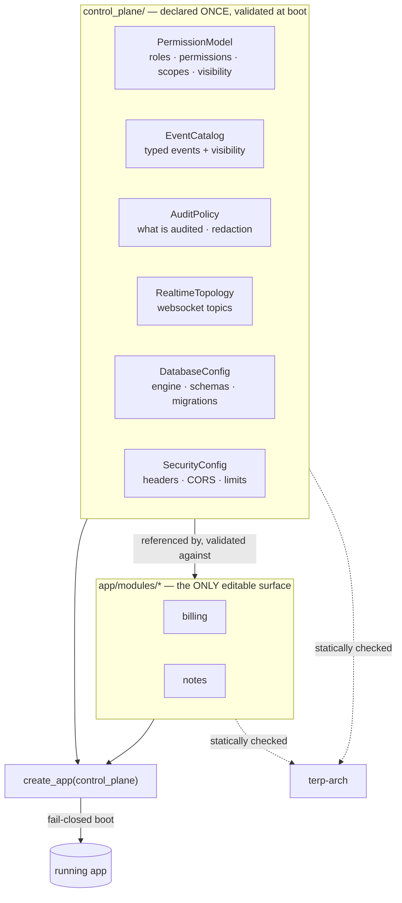
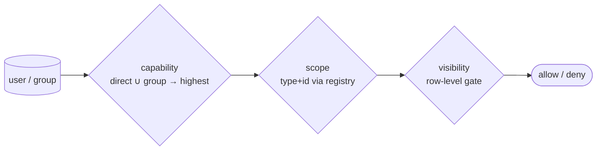

# Terp — Ground‑Up Implementation Plan & Control‑Plane Architecture

> **Purpose.** This document re‑checks Terp from first principles against one
> sharpened thesis — *restrict every consumer to centralized, enforced patterns
> so a non‑programmer working through a coding agent cannot drift, cannot
> duplicate a cross‑cutting concern, and cannot ship something insecure* — and
> turns that thesis into a concrete, phased build plan.
>
> **Status:** proposal for acceptance · **Audience:** platform/core team + agents.
>
> **Relationship to existing docs (no drift):**
> - [AGENTIC_PLATFORM_DESIGN.md](../AGENTIC_PLATFORM_DESIGN.md) remains the
>   canonical *vision*. This document refines its **backend execution** with the
>   control‑plane model and **supersedes the backend ordering of §13** once
>   accepted.
> - [docs/STATUS.md](STATUS.md) remains the **living checkbox tracker**.
> - Each phase below that encodes a decision lands an ADR under
>   [docs/decisions/](decisions/). When this file disagrees with a merged ADR,
>   **the ADR wins — fix this file.**

---

## 1. The thesis, stated precisely

Terp sells **one opinion**: *the safe, correct way to build a backend is the only
way the framework lets you build it.* A consumer (human or agent) writes
**modules** — and nothing else of consequence — by filling in a fixed set of
slots (model, schema, service, router, manifest). Every **cross‑cutting concern**
(authn/z, the permission model, the event bus, websockets, audit, logging,
database, deployment) is:

1. **Centralized** — declared exactly once per application, in a single
   **control plane**, so two modules can never define divergent copies (no drift).
2. **Abstract & swappable** — the *shape* is fixed by the framework; the *content*
   (which roles, which permissions, which events, which DB) is supplied by the
   consumer, so it fits **any** company's model.
3. **Off by default** — a concern that is not declared is **not active**. Turning
   it on is an explicit, visible, validated act — never an accident.
4. **Two‑layer enforced** — every rule is a **fail‑closed runtime control** *and* a
   **build‑time fitness test**. Forgetting the pattern fails the boot or the gate,
   never production silently.

> The difference from "a framework with good defaults" is **enforcement of
> centralization**. Good defaults let you wander off; Terp makes wandering off a
> boot error or a failed test with a fixable message.

---

## 2. Verdict: on the right track — additive, not a rewrite

The foundation already embodies the thesis and **should be kept**:

| Already correct | Why it stays |
|---|---|
| `terp.core` kernel (base models/service, config, db, errors+envelope, pagination) | The fixed module slots. No drift risk. |
| Deny‑by‑default `create_app` + policy guard (`BootError` on missing `Policy`) | The runtime spine of "off by default". |
| `ModuleSpec` as the single per‑module manifest | The one extension seam. Extend it, don't replace it. |
| `terp-arch` (7 AST rules + escape‑hatch budget ratchet) | The build‑time half of two‑layer enforcement. |
| `base_service.base_query()` central scope composition + scope-predicate registry | The non-overridable hook for tenant/visibility predicates; modules add filters via `business_filters()` (ADR 0017). |

**One genuine refactor is required**, and it is the keystone of this whole plan:

> 🔧 **Generalize the hardcoded `Roles` tier enum + bare‑string permissions into a
> centralized, consumer‑declared *permission model*.** Today `Roles`
> (`VIEWER/EDITOR/ADMIN`) is baked into `terp.core` and `access` stores
> free‑string `permission`s with no catalog. That cannot "fit any company" and it
> *is* drift‑prone (any module can invent a permission string). It becomes the
> first control‑plane registry (Phase A). The current 3 tiers become the **default
> model**, so existing behavior is preserved.

Everything else in this plan is **additive**: new control‑plane registries, new
capabilities, and new harness rules. No teardown.

> **Honesty boundary (see §9).** This stops *authority drift*, not *intent bugs*.
> A technical reviewer stays in the loop — that is a feature, not a gap. The
> framework's job is to **shrink** what they must review from "every router" to
> two small, stable surfaces (the *authority map* + the *opt‑out ledger*), which is
> precisely what makes a remote/paid audit cheap and repeatable.

---

## 3. The Control Plane — the centralization architecture

### 3.1 What it is

The **control plane** is a single, typed, boot‑validated object that an
application declares **once**. It is the one source of truth for every
cross‑cutting concern. `create_app` loads it, validates it fail‑closed, and wires
every module against it. Modules may **reference** control‑plane entries; they may
**never** invent their own.



### 3.2 The registries (one per concern)

Each registry is **required or optional**, and *optional ⇒ inactive until
declared*:

| Registry | Required? | Declares (the abstract shape) | Module references it as |
|---|---|---|---|
| **PermissionModel** | ✅ required | roles, named permissions, scope types (+validators), visibility axes, resolution strategy | `Policy(read=…, write=…)` |
| **EventCatalog** | optional | typed event definitions (name + payload schema + visibility) | `emits=[…]`, `subscribes=[…]` |
| **AuditPolicy** | ✅ required *(explicit opt‑out)* | which actions audit, redaction, retention | inherited (auto‑emit) |
| **RealtimeTopology** | optional | websocket topics + their visibility + backend (in‑proc/Redis) | `realtime=[…]` |
| **DatabaseConfig** | ✅ required | engine URL source, schemas, migration locations, tenancy binding | inherited |
| **SecurityConfig** | ✅ required (safe default provided) | headers, CORS allowlist, rate limits, body‑size cap | inherited (middleware) |

> **Two kinds of "off", and the difference is the whole point.** *Product
> features* (events, realtime) may be **silently absent** — undeclared simply
> means inactive, no ceremony. *Security controls* (audit, CORS, rate limits) may
> **not** be silently absent: their registry is required, and turning one off is an
> explicit, justified, budgeted act — `Audit.disabled(reason="internal demo")`,
> never a quiet omission. Forgetting a feature costs nothing; forgetting a control
> must be *visible*.

### 3.3 The consumer/agent file layout

```text
their-app/
  control_plane/                 # 🔒 THE SINGLE SOURCE OF TRUTH (one place per concern)
    __init__.py                  #   exports `control_plane: ControlPlane` (the one aggregate)
    permissions.py               #   roles + permissions + scopes + visibility — declared ONCE
    events.py                    #   the typed event catalog          (optional)
    audit.py                     #   audit policy                     (optional)
    realtime.py                  #   websocket topics                 (optional)
    database.py                  #   engine / schemas / migrations
    security.py                  #   headers / CORS / rate limits
    terp.toml                    #   declarative, env-overridable knobs (the data-only parts)
  app/
    main.py                      #   create_app(control_plane)        ← the only wiring line
    modules/                     # 🟢 THE ONLY EDITABLE BACKEND SURFACE
      billing/
        module.py  models.py  schemas.py  service.py  router.py
```

Two surfaces, two rules:

- **`control_plane/`** — edited rarely, reviewed carefully, owns every
  cross‑cutting decision. CODEOWNERS‑guardable.
- **`app/modules/*`** — edited freely by agents, but every line is checked against
  the control plane and the fixed module slots.

### 3.4 How a module references the control plane

```python
# app/modules/billing/module.py
from terp.core import ModuleSpec, Policy
from control_plane import permissions as perms, events, realtime

from .router import router
from .service import InvoiceService

module = ModuleSpec(
    name="billing",
    router=router,
    services=[InvoiceService],
    # 🔒 authz: references central permissions — never a bare string
    policy=Policy(read=perms.BILLING_READ, write=perms.BILLING_WRITE),
    # event bus: references the central catalog — never a bare "invoice.paid"
    emits=[events.INVOICE_PAID],
    subscribes=[events.PAYMENT_SETTLED],
    # websockets: references a registered topic — never an ad-hoc channel name
    realtime=[realtime.BILLING_STREAM],
    tenant_scoped=True,
)
```

If `perms.BILLING_READ`, `events.INVOICE_PAID`, or `realtime.BILLING_STREAM` is not
registered in the control plane, the app **fails to boot** (runtime) *and* the
harness flags any bare‑string literal used in its place (build‑time).

> **Current vs target (as of 2026‑06‑24).** `name` / `router` / `services` /
> `policy` / `tenant_scoped` exist on `ModuleSpec` today and `policy` references
> are boot‑validated. `emits` / `subscribes` / `realtime` above are the **target**
> manifest shape; they land with the event bus and realtime registries (Phases
> D/E). Until then `ModuleSpec.events` is an inert bare‑string field (ADR D3) and
> is **not** yet a typed control‑plane reference — see the known‑limitations note
> in [docs/STATUS.md](STATUS.md).

### 3.5 The permission model in depth (the centerpiece)

The control plane must express **any company's** model while forbidding drift. It
does so with **three orthogonal axes**, authored company‑agnostic from
established RBAC patterns:

1. **Capability axis (what you may *do*).** An ordered ladder *or* a set of named
   permissions — the consumer picks. The default model is the current
   `VIEWER < EDITOR < ADMIN` ladder, mapped onto named permissions so simple apps
   stay simple and rich apps get granularity. Subjects (users **and groups**) hold
   grants; effective capability is the **union of direct + group** grants,
   collapsed to the highest — resolved through **one** read boundary (no scattered
   role checks).
2. **Scope axis (over *which partition*).** A **polymorphic, FK‑less**
   `scope_type` + `scope_id`, validated through a **registry**: the owning module
   registers an existence‑check and a code→id resolver at import time, so the
   low‑layer permission capability never imports higher‑layer tables. New scope
   kinds (e.g. `project`, `region`, `team`) are a pure additive registration —
   **no company term is baked into core.**
3. **Visibility axis (which *rows* you may even see).** Row‑level security as a
   **separate** boolean gate, injected once via `base_service.base_query()` so a
   naive query cannot leak rows. **Read may be wider than write**; the framework
   never reuses the read predicate for mutation.



> 🔒 **Centralization guarantee.** All three axes are declared in
> `control_plane/permissions.py`. A module cannot define a role, mint a permission
> string, add a scope type, or hand‑roll a visibility `WHERE` clause — each is a
> harness violation. The *only* way to extend the model is to edit the one central
> file, which is exactly the anti‑drift property requested.

### 3.6 Two‑layer enforcement of centralization

| Centralization rule | 🔒 Runtime (fail‑closed) | 🧪 Build‑time (terp‑arch) |
|---|---|---|
| Every `Policy` cites a registered permission/role | boot rejects unknown reference | `policy_references_registered_permission` |
| No ad‑hoc permission/role string in a module | guard denies (no matching grant) | `no_adhoc_permission_literals` |
| Every emitted/subscribed event is in the catalog | `emit()` rejects unknown event | `events_reference_catalog` |
| Every websocket topic is registered | broadcaster rejects unknown topic | `realtime_topics_registered` |
| No bespoke visibility/tenant `WHERE` in a module | session‑level predicate is the only path | `no_manual_scope_filtering` |
| No hand‑set actor stamps in a module | `BaseService._save` fills them from the request actor | `no_manual_actor_stamping` |
| No raw session/engine construction | `SessionDep` is the only handle | `no_raw_session_construction` *(exists)* |
| Cross‑module / `_internal` imports | — | `no_cross_module_imports`, `no_internal_imports` *(exist)* |

### 3.7 The locked API contract (no string side‑door)

Five rules (cross‑review consensus) keep references **typed objects end‑to‑end** —
a string never *names authority* anywhere, so drift cannot creep back through a
side door:

1. **`Policy` accepts a `Role` *or* a `Permission`**, normalizing internally to a
   typed authorization requirement (never a string). Tier‑only apps stay simple;
   granular apps name capabilities. `Policy.tiers(read=…, write=…)` is sugar over
   the same normalized requirement.
2. **Declarations stay on `ModuleSpec`.** `policy` / `emits` / `subscribes` /
   `realtime` land on the one manifest, so boot validation, arch checks, generated
   docs, OpenAPI metadata, and "what does this module do?" all read **one object**.
   A large module may import local constants from a `.wiring` submodule, but the
   final declaration still lands on the spec.
3. **Every cross‑reference is an object, including nested ones** —
   `Topic("billing", visibility=perms.PROJECTS)`, never `visibility="project"`.
   Same for scope types, visibility axes, event names, and route‑level
   requirements.
4. **Security‑relevant absence is explicit** (see §3.2): `Audit.disabled(reason=…)`,
   not silent omission.
5. **`control_plane/` is a reserved package** — authority configuration, the one
   intentional exception to "no central registration" (it is *not* module
   registration). Modules may import typed symbols from
   `control_plane.{permissions,events,realtime}`; modules may **not** define ad‑hoc
   permissions/events/topics or use bare strings; the control plane may **not**
   import leaf‑module implementation code except declared validators/registrars
   through a controlled API.

---

## 4. Required refactors to current code (precise & small)

| # | Change | Files | Nature | Back‑comp |
|---|---|---|---|---|
| R1 | `Roles` enum → `PermissionModel` registry (default = current 3 tiers) | `core/module_spec.py`, new `core/permissions.py` | generalize | default preserves behavior |
| R2 | `Policy` references model entries (role tier **or** named permission) | `core/module_spec.py` | additive | `Policy.default()` unchanged |
| R3 | `create_app(control_plane=…)` loads + validates the control plane | `core/app.py` | additive (param defaults to a minimal safe plane) | existing calls keep working |
| R4 | `ModuleSpec` gains `emits` / `subscribes` / `realtime` typed refs | `core/module_spec.py` | additive | optional fields |
| R5 | `access` capability grows groups + scopes + visibility behind the model | `capabilities/access/*` | additive | flat grant remains the default resolver |
| R6 | `apps/example` declares a default `control_plane/` | `apps/example/*` | additive | proves the path end‑to‑end |

No existing test should need deletion — only additions. The gate stays green at
every step.

---

## 5. Phased implementation plan

Each phase: **lands a runtime control + a terp‑arch test + a STATUS/ADR update,
keeps `uv run pytest` green, and ships a short cookbook section for agents.**
Phases are ordered so the **spine (control plane + permission model)** exists
before the subsystems that hang off it.

### Phase A — Control‑plane spine + centralized permission model `[keystone]`
- Introduce `terp.core.control_plane` (`ControlPlane` aggregate + boot validation,
  fail‑closed) and `terp.core.permissions` (`PermissionModel`: roles + permissions
  + scope registry + visibility axes; default = current tiers).
- `create_app(control_plane=…)`; reject modules whose `Policy`/refs don't resolve.
- terp‑arch: `policy_references_registered_permission`, `no_adhoc_permission_literals`.
- `apps/example` gains a `control_plane/`.
- Minimal `terp inspect control-plane` (roles · permissions · modules · unknown
  references) — the first slice of the audit surface (§9.4).
- **Gate:** a module using a bare permission string fails boot *and* the harness.
- **ADR:** "Centralized control plane + permission model."

**Progress 2026-06-24.** ADR 0002 accepted; typed `Role` / `Permission` /
`PermissionModel`, `ControlPlane`, `Policy` normalization, `create_app(...,
control_plane=...)` validation, reference-app `control_plane/`,
`no_adhoc_permission_literals`, and minimal `terp inspect control-plane` are
implemented. Gate: **92 passed**. The static registry-resolution rule for typed
policy references remains pending; runtime boot validation is already in place.
Remaining Phase A work is tracked in [docs/STATUS.md](STATUS.md).

**Conformance + coverage gate 2026-06-24 (ADR 0003).** The enforced suite landed:
two framework-conformance scanner rules (`table_models_use_base_table`,
`no_app_instantiation`), a harness self-completeness meta-test, a **100% framework
line-coverage gate** (`pytest --cov=terp`, `fail_under = 100`), the
`terp inspect control-plane --format mermaid` authority-map visualization, and a CI
workflow running the whole gate on every push/PR. Gate: **141 passed, 100% line
coverage**. See
[ADR 0003](decisions/0003-conformance-and-coverage-gate.md).

### Phase B — Permission model depth (groups · scopes · visibility)
- Groups + group grants with union‑to‑highest resolution through one read boundary.
- Polymorphic scope registry (validators + code resolvers), company‑agnostic.
- Visibility axis injected via `base_query()`; read‑wider‑than‑write enforced.
- terp‑arch: `no_manual_scope_filtering`.
- **Gate:** cross‑scope and row‑visibility tests pass for two divergent models.

### Phase C — Security middleware + structured logging
- `SecurityConfig`: headers, CORS deny‑by‑default (boot‑fails in prod if unset),
  rate‑limit, body‑size, request‑id. Structured logging + request‑id context +
  PII redaction. Extend production fail‑fast.
- terp‑arch: `security_config_present`, `prod_guardrails`.
- **Gate:** prod boot refuses on permissive CORS / missing limits.

**Progress 2026-06-24 (ADR 0005).** Shipped: `terp.core.SecurityConfig`
(`SecurityHeaders` + deny‑by‑default `CorsPolicy` + `RateLimit` + body‑size +
request‑id header) on `ControlPlane.security`; `create_app` installs the middleware
stack (CORS · request‑id · security‑headers · rate‑limit · request‑size‑limit) and
`configure_logging()` (request‑id context var + `RedactingFilter` PII scrubbing +
JSON `StructuredFormatter`); production fail‑fast extended to refuse unset/`"*"`
CORS and a disabled rate limit. The two enforceable build‑time rules are the
**centralization** pair `no_adhoc_middleware` + `no_adhoc_logging_config` (the
"config present / production‑safe" guarantee is a required, defaulted registry +
`production_problems()` runtime boot check, not a build‑time‑only control — see the
rule‑name note in [ADR 0005](decisions/0005-security-middleware-and-structured-logging.md)).
Gate: **179 passed, 100% line coverage**; example app dogfoods clean (budget `{}`).

### Phase D — Event bus (EventCatalog) + audit (AuditPolicy)
- Outbox bus: typed `emit()` accepting only catalog events; handler registry;
  worker dispatch. Audit auto‑emit on every mutation; central redaction/retention;
  allowlisted opt‑out (budgeted).
- terp‑arch: `events_reference_catalog`, `mutations_emit_audit`.
- **Gate:** a mutation with no opt‑out produces an audit row without module wiring.

**Progress 2026-06-24 (ADR 0007) — audit shipped, event bus split out.** The audit
half landed as the full ADR 0006 quadruple: an `AuditPolicy` registry on
`ControlPlane.audit` (safe default = audit every mutation, central redaction,
retention knob, explicit `AuditPolicy.disabled(reason=...)`); fail‑closed auto‑emit
from the single `BaseService` `_save` / `_remove` chokepoint inside the write's
transaction; the `mutations_emit_audit` terp‑arch rule (registered + tested + in
the self‑completeness meta‑test); and a budgeted opt‑out. Layering is honoured —
`terp.core.audit` is the seam (log‑only default sink) and the opt‑in
`terp-cap-audit` supplies the durable append‑only `AuditEvent` table +
`persist_audit` sink + an admin‑only read router, wired by
`create_app(audit_sink=...)`. The **event bus** then landed as a separate slice
(ADR 0008): a typed `EventCatalog` on `ControlPlane.events` (default empty — an
*optional* product feature, no‑drift not always‑on), a fail‑closed `emit` that
accepts only catalog events, the `events_reference_catalog` rule, typed
`ModuleSpec.emits` / `subscribes` validated at boot, and the in‑process
`terp-cap-eventbus` dispatcher behind a no‑op core seam (durable outbox deferred).
Gate: **230 passed, 100% line coverage**; example app dogfoods both clean
(budget `{}`). See
[ADR 0007](decisions/0007-audit-auto-emit-and-the-audit-seam.md) and
[ADR 0008](decisions/0008-event-bus-catalog-and-typed-emit.md).

### Phase E — Realtime / websockets (RealtimeTopology)
- Broadcaster (in‑proc + Redis), **driven by the bus**, topics registered centrally.
- terp‑arch: `realtime_topics_registered`.
- **Gate:** publishing to an unregistered topic fails; in‑proc↔Redis swap is config‑only.

### Phase F — Database management + migrations (DatabaseConfig)
- Packaged Alembic, multi‑location + branch labels (core + caps + modules), driven
  by `DatabaseConfig`. `terp migrate upgrade/downgrade`.
- **Gate:** install capability → upgrade → downgrade works headlessly.

### Phase G — Deployment to containers
- Dockerfile + compose scaffold parameterized by the control plane (prod profile,
  health checks, non‑root, read‑only FS, secrets via env). Off‑by‑default extras
  (Redis) appear only when their registry is declared.
- **Gate:** `docker compose up` boots the example app with the prod guardrails on.

### Phase H — CLI + copier template + agent docs
- `terp new module` (scaffold + passing test), `terp check` (== CI), `terp doctor`
  (validates the control plane and prints the resolved model). `terp inspect
  control-plane` expands to the full authority map + warnings + a `--json` audit
  bundle + "diff vs git ref" for remote/paid audit (§9.4).
- Copier `template/` wiring a base profile + a ready `control_plane/`.
- **Agent cookbook**: one page per concern ("how to add a permission", "how to emit
  an event", "how to add a websocket topic") + per‑area `.instructions.md`.
- **Gate:** `terp new module x` passes the local gate with zero central edits beyond
  the (reviewed) control plane.

> Tracks C–G are largely independent and can be reordered to taste **after** A and
> B land; A is the keystone and must be first.

---

## 6. New `terp-arch` rules introduced (summary)

`policy_references_registered_permission` · `no_adhoc_permission_literals` ·
`no_manual_scope_filtering` · `security_config_present` ·
`events_reference_catalog` · `mutations_emit_audit` · `realtime_topics_registered` ·
`control_plane_import_boundary` (modules import only typed control‑plane symbols; the
plane never imports module code except declared validators).

The **residual‑drift hardening rules** (object‑level authz, mass‑assignment,
unsafe‑primitive, looser‑route‑override, dependency‑audit — see §9.2) layer in
across Phases B–F as each subsystem lands.

Each ships with the escape‑hatch budget at **0** in `apps/example`, so any future
opt‑out is a visible, justified, budgeted bump.

---

## 7. Decisions

**Locked (cross‑review consensus — see §3.7):** ① `Policy` accepts
`Role` | `Permission`, normalized to a typed requirement. ② Declarations stay on
`ModuleSpec`. ③ Every cross‑reference is a typed object, never a string.
④ Security‑relevant absence is explicit & budgeted (`Audit.disabled(reason=…)`).
⑤ `control_plane/` is a reserved package with an import boundary. ⑥ Format = typed
Python + `terp.toml` for pure data (Q1). ⑦ Permission default = tiers mapped to
named permissions (Q2).

**Confirmed on 2026-06-24:** Q3 = **C** (security middleware + structured
logging) after the A/B keystone; Q4 = top-level `control_plane/`. These are
recorded as [ADR 0002](decisions/0002-control-plane-and-auditable-module-authority.md).

---

## 8. What this guarantees for a non‑programmer + agent

1. They write a module by filling fixed slots; the agent has a cookbook per slot.
2. They cannot duplicate or fork a cross‑cutting concern — there is exactly one
   place for each, and the harness proves it.
3. Anything they forget to configure is **off**, not insecurely on.
4. Anything they misconfigure **fails at boot or in the gate** with a fixable
   message — never silently in production.

That is "built right from the ground up": the patterns are not advice, they are
the only path the framework allows.

---

## 9. Auditability & the residual‑drift boundary

### 9.1 The honest claim

A well‑formed control plane + boot validation + the arch gate makes modules
**unable to drift across declared platform concerns**: no undeclared or typoed
permission, no invisible event/topic, no missing policy wiring, no locally‑invented
security concept, no cross‑module or `_internal` import, no raw session / SQL / HTTP.

It does **not** prove **intent**: that a business rule is correct, that the
visibility model is *semantically* right, that a scope validator is *complete*, or
that a service's logic is bug‑free. A control plane can be well‑formed and still be
wrong on purpose.

> **A technical reviewer is therefore part of the system, not a failure of it.**
> The framework does not remove the reviewer — it **concentrates** what they review
> from "every router" to **two small, stable surfaces**: the *authority map* and
> the *opt‑out ledger*. That is what makes a remote or paid audit tractable.

### 9.2 Where drift still hides (routes, models, endpoints) — and the control for each

These are the residual painpoints once the control plane exists. Each is pulled
toward a **mechanical control** so the human only has to review *intent* (mostly the
OWASP API Top 10):

| # | Residual drift | Where | Mechanical control (push into framework) | Human still judges |
|---|---|---|---|---|
| D1 | **Broken object‑level authz (IDOR/BOLA)** — read/mutate another tenant's row by id | route/service | all reads/writes go through `BaseService` on the `base_query()` seam; **ban `session.get` / raw `select` in routers**; visibility predicate auto‑applied | "is read meant to be this wide?" |
| D2 | **Mass assignment** — write schema accepts `owner_id` / `tenant_id` / `is_approved` | schemas | write schemas are **explicit allowlists** with `extra="forbid"`; framework‑owned columns not settable; arch rule bans server‑owned field names in write schemas | which business fields are user‑settable |
| D3 | **Excessive data exposure** — a DTO leaks a sensitive column | schemas/router | `response_model` required *(exists)* + **sensitive fields typed** (`Secret[…]`) masked by default; arch rule: read schema may not expose a `Secret` field | is this field OK to expose |
| D4 | **Function‑level authz gap** — a sensitive endpoint looser than its module policy | router | per‑route override must be **declared & ≥ module policy**; *looser* needs a justified, budgeted opt‑out | is this endpoint's level right |
| D5 | **Unsafe primitives** — outbound HTTP (SSRF), `open()` / path traversal, `subprocess`, naive `datetime`, `eval` / `pickle` | anywhere | arch rule bans them in modules; outbound calls only via a core‑provided, timeout‑capped client | is this integration intended |
| D6 | **Secrets / config sprawl** — hardcoded key, scattered `os.environ` | anywhere | secrets only via `Settings` / sealed config; arch rule bans `os.environ` in modules; secret scanning in CI | — |
| D7 | **Unbounded queries** — a custom list returns `.all()` | service | list endpoints require `Page[T]` / pagination dep *(partial)*; arch rule on list routes | — |
| D8 | **Schema/migration drift** — model changed without a migration | models | `terp check` diffs models vs migrations; CI fails on drift | review the migration |
| D9 | **Dependency supply chain** — agent adds an arbitrary package | pyproject | lockfile + allowlist + `pip-audit` / `deptry` in the gate | approve new deps |
| D10 | **Business‑rule / semantic correctness** | service | — *(not mechanizable)* | **yes — the core review** |

The pattern: **D1–D9 each become a fixed control + a failing test**; D10 (and the
right‑hand column) is the small, stable surface the technical reviewer actually
spends attention on.

### 9.3 The separation that makes remote audit cheap

Four boundaries, each independently checkable, so an auditor can trust the parts
without reading all the code:

```text
┌ framework (terp.*) ───────── consumer cannot edit (vendored read-only + CODEOWNERS)
├ control_plane/ ──────────── AUTHORITY: declared once, CODEOWNERS-gated, diffable
├ app/modules/<m>/ ───────── IMPLEMENTATION: sandboxed; no cross-module/_internal/DB/HTTP
└ escape-hatch budget (json) ── OPT-OUT LEDGER: every deviation, justified, ratcheted
```

- **Authority ≠ implementation.** `control_plane/` is the one place security lives;
  it is reviewed on every change, separately from module churn.
- **Modules are sandboxed.** They cannot reach each other, core internals, the DB
  engine, the network, or secrets — so an auditor reasons about one module in
  isolation.
- **Every deviation is on the ledger.** The escape‑hatch budget is the *complete*
  list of "where we stepped outside the pattern," each with a reason and an owner.

### 9.4 The audit surface: `terp inspect` (build it early)

The artifact that makes remote/paid audit practical is a **generated authority
map**, not a code read. `terp inspect control-plane` renders the whole posture and
flags smells:

```text
Roles        viewer < editor < admin
Permissions  billing.read viewer+ · billing.write editor+ · billing.close admin+
Modules
  billing    read=billing.read  write=billing.write
             emits=billing.invoice_paid  subscribes=billing.payment_settled
             realtime=billing (visibility: project ✓ validator registered)
             tenant_scoped=true
Opt-outs (escape-hatch ledger)
  app/modules/billing/router.py:88  arch-allow-no-manual-scope-filtering
    reason: "admin cross-tenant reconciliation report"   approved-by: <codeowner>
Warnings
  ⚠ unused permission: billing.close
  ⚠ no audit config in production profile      ← security-relevant absence
  ⚠ module 'billing' has 1 looser-than-policy route override
```

A remote auditor (service or human) reviews **this report + the ledger diff since
last audit** — not the routers. That is the moment the system becomes approachable
to a non‑technical owner: one **authority map** instead of spelunking dependencies.
`terp inspect` ships minimal in Phase A and grows the warnings + `--json` bundle +
git‑diff view in Phase H.

### 9.5 The non‑technical owner's loop

1. Owner describes a module in plain language.
2. Agent scaffolds the module **and** proposes the `control_plane/` diff.
3. Boot validation + `terp-arch` reject bad references and unsafe omissions.
4. A **technical reviewer** (in‑house or a paid remote service) approves **two
   diffs only** — the control‑plane change and any new opt‑out — guided by
   `terp inspect`.
5. The module body is mechanically constrained, so trusting the *boundary* does not
   require reading it line‑by‑line — only judging its *intent*.

That is realistic agentic development with a human in exactly the right, minimal
place — not no‑code, and honest about it.

---

## 10. Cross‑cutting controls roadmap & the opinionation policy (Tier A/B/C)

> **Why this section exists.** Terp's value grows with every cross‑cutting concern
> it makes "always correct by default." But unbounded opinionation would make the
> framework fit only CRUD‑shaped apps and break "applicable to any company." This
> section records **how far we go, and the rule that keeps it from becoming a
> straitjacket**, so future slices don't relitigate it. Recorded as
> [ADR 0006](decisions/0006-cross-cutting-controls-and-opinionation-policy.md).

### 10.1 The opinionation policy — every "always X" is one of three tiers

| Tier | Meaning | How opinionated | Examples |
|---|---|---|---|
| **A — Mandatory** | No business app should ever skip it. On by default; opt‑out is explicit + justified + **budgeted**. | Maximally. Fail‑closed runtime + build‑time test. | authz, **audit of mutations**, input caps, error envelope, security headers, OCC, pagination, PII redaction, no‑raw‑SQL |
| **B — Defaulted, overridable** | Varies by company. Ships a safe default in a typed control‑plane registry; the consumer overrides the *values*, never the *shape*. | The *shape* is fixed; the *content* is the consumer's. | password policy, rate‑limit numbers, table‑name pattern, route prefix, retention windows, CORS origins, soft‑delete on/off |
| **C — Optional sugar** | Authoring convenience; never the only path. | Provided, but a module may always drop to native FastAPI/SQLModel with the same arch rules applying. | CRUD router factory, `terp new module` scaffolding |

**The governing rule (the "quadruple").** A concern may become a framework control
only if it ships as all four of: ① a typed control‑plane registry with a
**safe default**, ② a **fail‑closed runtime control**, ③ a **build‑time test**,
and ④ a **budgeted escape hatch**. If it can't be expressed that way, it is a
*product* decision, not a framework control, and stays out of `terp.core`. This is
the honest ceiling: we relieve the consumer of *implementing* cross‑cutting
concerns without removing their ability to *configure* them.

> **Two kinds of "off" (restated from §3.2).** *Product features* (events,
> realtime) may be silently absent. *Security/governance controls* (Tier A) may
> not — their registry is required and turning one off is a visible, justified,
> budgeted act. Forgetting a feature costs nothing; forgetting a control fails the
> boot or the gate.

### 10.2 Inventory & roadmap (status as of 2026‑07‑07)

| Concern | Tier | Status | Where / next step |
|---|---|---|---|
| AuthZ (deny‑by‑default) | A | ✅ built | `create_app` guard |
| Error envelope (incl. **catch‑all 500**) | A | ✅ built | `register_error_handlers` (catch‑all added in the Phase C hardening) |
| OCC → 409 · pagination caps · input caps | A | ✅ built | `BaseTable` / `Page[T]` / arch rule |
| Security headers · CORS · rate‑limit · body‑size · request‑id | A | ✅ built | `SecurityConfig` (Phase C, ADR 0005); rate‑limit counter behind the pluggable `ThrottleStore` (default in‑memory; shared seam ADR 0036, Redis‑backed adapter shipped in `terp-cap-redis`, ADR 0078) |
| **Idempotency keys for unsafe methods** | B | ✅ built | `terp.core.idempotency` `IdempotencyStore` + innermost `IdempotencyMiddleware` (credential‑scoped, fail‑closed 503, replay 422/409, ADR 0077); Redis adapter in `terp-cap-redis` |
| **Shared stores for multi‑instance** (throttle / idempotency / cache) | B | ✅ built | `terp-cap-redis` Redis‑backed `ThrottleStore` / `IdempotencyStore` / `CacheStore` adapters (atomic Lua; ADR 0078) |
| Structured logging + PII redaction | A | ✅ built | `terp.core.logging` (handler‑level redaction + `extra=` in the hardening) |
| **Audit log of mutations (auto‑emit)** | A | ✅ built | `AuditPolicy` registry on `ControlPlane.audit`; fail‑closed emit from the single `BaseService.create/update/delete` chokepoint; central redaction; core seam + `terp-cap-audit` durable sink; the `mutations_emit_audit` rule **and a runtime write‑guarded `SessionDep`** (a write outside the chokepoint raises `UnauditedWriteError`, ADR 0015); budgeted opt‑out (ADR 0007) |
| **Password policy** (length/complexity/breach) | B | ✅ built | `PasswordPolicy` registry on `ControlPlane.passwords` (safe default: 12+ chars, 2+ classes, common-password denylist); fail-closed at the `UsersService` credential boundary (typed `WeakPasswordError`, uniform 422); `create_app` production fail-fast on a relaxed policy; `PasswordPolicy.relaxed(reason=…)` opt-out (ADR 0032). Runtime/boot-only — no AST rule. HIBP breach-corpus check deferred. |
| Account lockout / brute‑force throttle | B | ✅ built | `terp-cap-auth` `LoginThrottle` (on by default; per‑account; explicit `LoginThrottle.disabled(reason=…)`); typed 429 `AccountLockedError` (ADR 0031). Multi‑instance correct via the shared `ThrottleStore` seam (ADR 0036). |
| **Token revocation + mid‑session `is_active` re‑check** | A/B | ✅ built | per‑user **token epoch** (`token_version`) on the access token + a revocable `get_principal` (`build_get_principal(token_validator=…)`, one‑call via `IdentityService.principal_provider()`); bumped on deactivate / role‑change / password‑reset / logout through the audited `users` chokepoint; `create_app(require_token_revocation=True)` boot guard (ADR 0031). Runtime/boot‑only — no AST rule. Refresh‑token rotation + `jti` deny‑list deferred. |
| Access/request logging (per request) | B | ⬜ backlog | opt‑in, structured, redacted |
| **`__tablename__` required + name pattern** | A/B | ⬜ planned | runtime `BaseTable.__init_subclass__` check **+** arch rule; the *pattern* (snake_case, length) is a control‑plane default. *Today: implicit SQLModel naming is unenforced drift.* |
| **Route prefix/suffix in the control plane** | B | ⬜ planned | promote the hardcoded `/api/v1/{name}` to a routing registry default |
| **CRUD router factory** | C | ⬜ planned | `build_crud_router(service, schemas=…, policy=…)` returning a native `APIRouter`; kills router drift without a DSL |

### 10.3 Model / route / schema authoring — how far to abstract

The router is today's biggest drift surface (every flat module re‑types the same
five CRUD endpoints). The stance is **assemble from native primitives; never
replace them**:

- **Level 0 (today):** hand‑written native SQLModel/FastAPI. Max flexibility, max
  drift, fully verifiable.
- **Level 1 (adopt):** an opt‑in `build_crud_router(...)` factory + stricter
  `BaseTable` rules (`__tablename__` required, name pattern from the control
  plane). A flat module declares intent once and gets identical, wired CRUD; a
  custom module still hand‑writes its router. **Kills drift without removing native
  control or verifiability** — it is just a function returning an `APIRouter`.
- **Level 2 (avoid as the *only* path):** a declarative model/route DSL
  (fields + routes as control‑plane data, code‑genned). Tempting for "100 %
  verifiable," but it fights SQLModel/FastAPI idioms, caps flexibility (every real
  app eventually needs a relationship/validator/query the DSL can't express), and
  moves bugs into an opaque generator. Keep code‑gen as **scaffolding**
  (`terp new module` emits readable Level‑1 code you own), never a runtime black
  box. Code stays the source of truth.

### 10.4 Model traits vs. control-plane policy (ADR 0011)

The control plane centralizes **shared vocabularies** and **app-wide singletons**;
it must not become a central list of leaf tables or model classes. The boundary is:

> **Traits on the model declare the _which_; control-plane policies configure the
> app-wide _how_.**

Examples:

| Model trait (local source of truth) | Future database/control-plane policy (global behaviour) |
|---|---|
| `SoftDeleteMixin`: this table is soft-deletable | retention window, purge schedule, privileged "include deleted" reads, hard-delete policy |
| `TenantScopedMixin`: this table is scoped | tenant binding strategy / scope-predicate provider |
| `ActorStampedMixin`: this table stores creator / last‑editor ids (ADR 0012) | required vs. best‑effort stamping outside a request; system actor for jobs |
| value-object mixins (address fields, etc.) | usually no policy; columns only |

Rejected: `DatabasePolicy(soft_delete_tables=[...])` or an exclude-list of table
names/classes. A typed central list would make `control_plane/` import leaf module
models (violating §3.7); a string list would reintroduce typo drift; either makes a
module less locally readable. Use `terp inspect` for the **central generated view**
(`Task: soft-delete ✓`) without making that view the source of truth. If an app
wants soft-delete as its local default, it can define its own base model that mixes
in `SoftDeleteMixin`, while opt-outs remain visible in the model inheritance.

### 10.5 Phase C hardening (landed 2026‑06‑24, post‑ADR 0005)

Four defects found in review of the shipped Phase C slice were fixed before moving
on (Tier‑A correctness; they *complete* controls rather than add features):

1. **Logging redaction bypass** — redaction now lives on every **handler** (not
   only the root logger), so a child logger cannot leak through a pre‑existing
   handler; sensitive `extra=` fields are redacted too.
2. **CORS preflight** — request‑id + security headers now **wrap** CORS, so a
   preflight response also carries them.
3. **`no_adhoc_middleware`** — now also catches the `@app.middleware("http")`
   decorator form, not just `add_middleware` / `BaseHTTPMiddleware`.
4. **Catch‑all exception → envelope** — an unexpected exception is logged (with the
   request id) and rendered as a generic `internal_error` 500 envelope, so a bug
   never leaks a stack trace nor escapes the uniform `{code, detail, request_id}`
   contract.

Gate after hardening: **182 passed, 100 % line coverage**.

### 10.6 Generic CI backstops (landed 2026‑06‑29, ADR 0033)

Phase 3 ("delegate layering to a tool") is finished by wiring generic, off‑the‑shelf
enforcement **around** the gate, never weakening `terp‑arch`:

- **ruff `S` (bandit)** — repo‑wide security backstop (exec/eval, weak hash, unsafe
  deserialize, bind‑all, SQL‑string injection, shell‑true); noisy name heuristics
  (`S101/S105/S106`) excused, clean with zero source edits.
- **import‑linter** — a `forbidden` contract mirroring the `terp.core` layer‑0
  keystone (`test_core_boundary`), so layering is enforced twice (two‑layer rule).
- **pip‑audit · deptry** — advisory supply‑chain + per‑package dependency hygiene.

Split: blocking ruff + import‑linter and advisory pip‑audit + deptry run in a CI‑only
`generic‑checks` job from a `lint` dependency group; the `pytest --cov=terp` gate is
unchanged. No `terp.*` logic changed.
